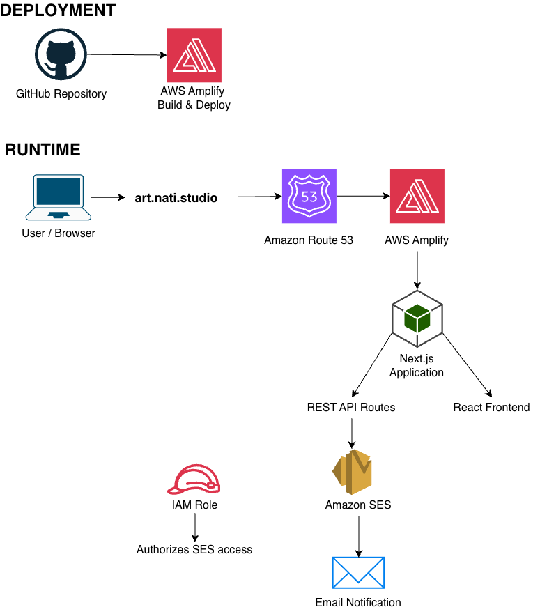

# Nati Salinas Art — The World of Rosa

A full-stack artist portfolio and commission platform built with Next.js, React, TypeScript, and AWS.

The application provides a responsive storefront and portfolio experience while demonstrating full-stack software engineering concepts including REST API development, server-side form processing, cloud integrations, email automation, IAM-based service access, custom domain configuration, and automated deployments.

Live Site: https://art.nati.studio

## Engineering Highlights

- Built a full-stack application using Next.js, React, and TypeScript
- Developed server-side REST API endpoints using Next.js Route Handlers
- Integrated the application with Amazon SES using the AWS SDK
- Configured AWS IAM permissions for secure application-to-service communication
- Implemented custom domain routing and HTTPS using Amazon Route 53 and AWS Amplify
- Automated application deployments from GitHub
- Designed responsive layouts for desktop and mobile users
- Implemented reusable components for artwork, products, purchases, and commission workflows

## Features

- Responsive artist portfolio
- Horizontal artwork gallery
- Product catalog
- Multi-product purchase request form
- Custom art commission request form
- Server-side form processing with Next.js API routes
- Email notifications through Amazon SES
- Responsive navigation and mobile layouts
- Custom metadata, favicon, and social sharing image
- Custom domain with HTTPS
- Automated deployments from GitHub

## Tech Stack

### Frontend

- Next.js
- React
- TypeScript
- Tailwind CSS
- Next.js Image Optimization

### Backend

- Next.js Route Handlers
- AWS SDK for JavaScript
- Amazon SES

### Infrastructure

- AWS Amplify Hosting
- AWS IAM
- Amazon Route 53
- Amazon SES
- GitHub

## Architecture

The application is automatically deployed from GitHub to AWS Amplify. User requests are served by the Next.js application, while server-side REST endpoints integrate with Amazon SES through the AWS SDK using IAM authorization.

